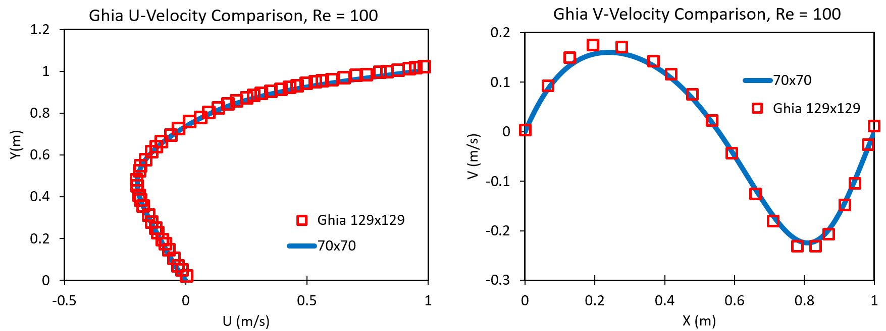

# 2D Lid Driven Cavity

## Objective 
The objective of this work is the development of the time independent non-linear Navier Stokes equations for a two-dimensional cavity. 

The Finite Volume method was used along with the SIMPLE algorithm to solve the momentum and continuity equations. The Finite Volume method is used extensively as the conservation equations easily be changed from volume integrals to surface integrals through Gauss’ Divergence Theorem. 

## Assumptions
In this method, the assumption is made that mass and momentum are conserved over discretized domains and that the flow is steady state and uniform in density. 

## Algorithm
This project utilizes the SIMPLE algorithm on a staggered grid, which is an iterative method that starts with an initial guess of the velocities and pressures. These fields will then be used to solve the next iteration and a correction factor is applied to correct each field. 

## Validation
Verifying the Lid Driven Cavity code required a verification with previous literature. The work Ghie et al is used to ensure a sufficient solution of the code. 

## Results
<!-- -->
### U and V solution

  
  

### Veloctiy Comparison with Ghia

### Residuals

